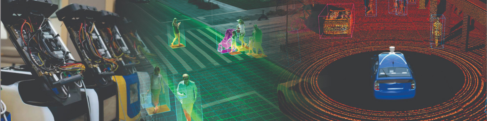
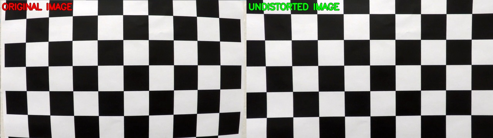
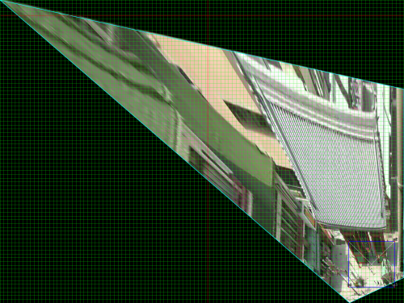
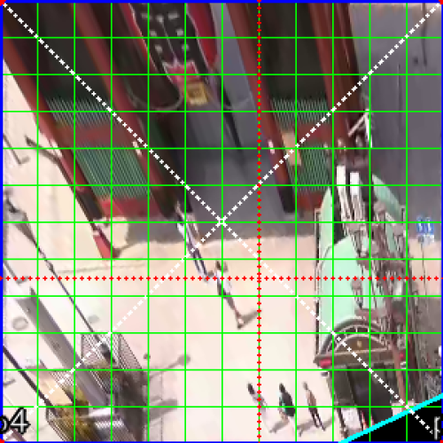
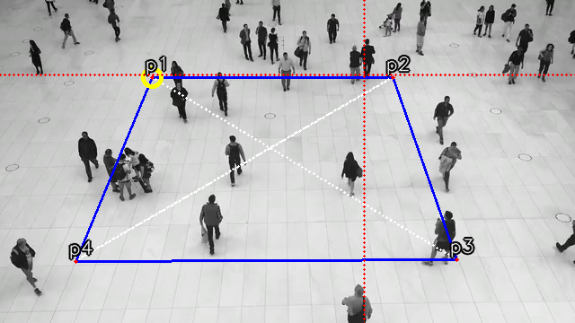
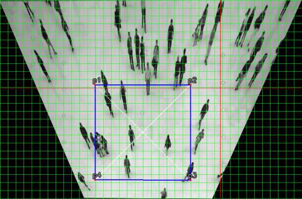
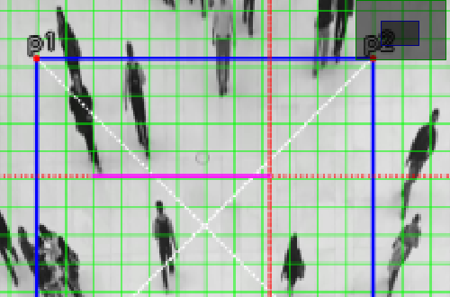
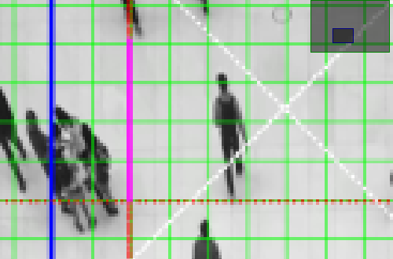

# **Social Distancing Analyzer**

<p align="center">
  
</p>

Considering the big change that the world is facing, as well as our lives due to the COVID-19, we provide to people and companies a complete open-source tool to analyze the social distancing for streets, parks, offices, and even crowded places like malls, train stations, and others. 

Here you have the code and everything that you'll need to perform your own intrinsic and extrinsic calibration, and run a YOLOv4 based object detection model to track the people in a warped space and analyze how far or close they are to each other (Social Distancing).

The current pipeline only supports videos, but you can use the base classes, and methods to extend the application to video streamings, pictures and adapt it to your own project or application. Here, we will explain the dependencies, the code, and everything that you need to rock and roll!

**Status**: Archive (code is provided as-is, no updates expected)

<p align="center">

</p>

<sub>#computer-vision #Ai #object-detection #yolo #yolo4 #python3 #Docker #covid19 #extrinsic #intrinsic #calibration #social-distancing #OpenCV #OpenSource #image-processing #deep-learning </sub>

---
### **Install Anaconda Environment**

Anaconda is the preferred method of installing SafeDistanceDetector dependencies on Linux Systems (Only for Extrinsic and Intrinsic calibration process). Anaconda is a data science platform for scientific computing and makes managing machine learning libraries significantly easier. Native installation of these libraries is possible, but native un-installation of these libraries can be significantly painful and introduce significantly much more bloat. which is why We DO not will not be supporting that method of installation.

To download the installer, follow this link and download the Anaconda platform for Linux x64. https://www.anaconda.com/distribution/#linux.

After installing the platform, you might need to add conda command into your path for further usage of the platform. You can do this with the following commands.

    export PATH=~/anaconda3/bin:$PATH
    conda init bash
    # Restart your shell
    
---
### **Install SafeDistanceDetector Environment**

You will now need to create the social distancing analyser environment with the required dependencies and libraries (provided in ```requirements.txt```). 

To create and to activate the environment, run:

    conda create -n distancing_analyser -c main python=3.6.8
    conda activate distancing_analyser
    python -m pip install -r ./Safe-Distance-Detector/requirements.txt

After this, fork this repo and make sure that your environment is activated and you are in the root path. Again, this environment is only for Intrinsic (If needed) and Extrinsic calibration scripts, you can not run nothing related to object detection on this environment.

---
### **Build and Run Docker Image**

The object detection model pipeline is based on [YOLOv4](https://github.com/AlexeyAB/darknet) and its dependencies, compilation, and configuration are packaged in a Docker Image. Before continuing, make sure you have [Docker](https://docs.docker.com/get-docker/), [Nvidia Docker](https://github.com/NVIDIA/nvidia-docker), and **440 Nvidia Drivers** installed in your system.

To run the Social Distancing Analyser Docker Image, just run the bash script ```start.sh```. If it's the first time probably is going to take a while, so, go for a soda and watch a series chapter or have a look at the meme zone for fun.

you can also try by hand every command line, specially if the image is already built.

    xhost +
    
    docker build -t working_mage .
    
    docker run -it -v `pwd`/configs:/usr/src/app/configs -v `pwd`/media:/usr/src/app/media -v `pwd`/python_utils:/usr/src/app/python_utils --rm --gpus all -e DISPLAY=$DISPLAY -e QT_X11_NO_MITSHM=1  -v /tmp/.X11-unix:/tmp/.X11-unix working_mage bash

---
### **Intrinsic Calibration (Optional)**

The process of geometric camera calibration is a fundamental step for any machine vision and robotics applications. The intrinsic parameters, also known as internal parameters, are the parameters intrinsic to the camera itself, such as the focal length and lens distortion. This distortion should be corrected to operate mathematically easier the image on a warped space or in a affine transformation. Unfortunately, the result of the calibration process can vary a lot depending on many factors.

<p align="center">

</p>

With the script ```calibrate_instirnsic.py``` located in *./calibration* path you can calculate the correct camera matrix and distortion coefficients of your camera using a  [calibration chessboard pattern](https://storage.googleapis.com/vision-198622-kiwibot-packages/documentation_resources/vision/chessboard.pdf) (6x4). The distortion matrix is used to undistort the video, images or the camera streaming for extrinsic calibration and warped space operations.

[Chessboard for Calibration](https://storage.googleapis.com/vision-198622-kiwibot-packages/documentation_resources/vision/chessboard.pdf): The pattern size and quality is of extreme importance. Let’s consider the case of a chessboard pattern. The calibration process requires to detect the inner corner of the chessboard and the assumption of the algorithm is that every chessboard square is a perfect square. Another assumption is, hence, that the pattern is **perfectly planar**. So, DO NOT print the pattern at home. Seriously. Go to a professional print shop and ask them to create the pattern for you. They have the right software to create the chessboard with squares with the real desired square size with an extremely high accuracy. More than everything, they can print the pattern on a white opaque, rigid and planar material. Stress the print shop to print on some extremely rigid opaque white material. You should read [Camera calibration guidelines](https://pgaleone.eu/computer-vision/2018/03/04/camera-calibration-guidelines/).

If you are making your calibration videos, or taking pictures from the camera that you are gonna use. remember move the chessboard across through all the camera view, apply a pitch, roll and yaw angle, and move the pattern in all directions.When you run the script, you'll get a help menu. Use between 15 to 25 pictures of your chess board pattern following the previous instructions and recommendations. 

1 - Move the pattern along the camera view           |  2 - Apply a pitch, roll and yaw angle
:-------------------------:|:-------------------------:
    |  

You can calibrate taking snapshots from your camera, or from pictures or from videos just run:

    python3 calibration/calibrate_intrinsic -i <<your input: video name, imgs path or video device>>

Remember pass `-i` argument as absolute path for videos, if input argument is an image, it should be located in the *./calibration/chess_board*. 

If the calibrations succeed you get a [ **intrinsic.yaml**](https://github.com/JohnBetaCode/Safe-Distance-Detector/blob/develop/configs/intrinsic.yaml) file in the *./configs* folder. This yaml file has the next data:

* **distortion_coefficients**: vector of distortion coefficients 
* **rectification_matrix**: camera distortion matrix
* **camera_matrix**:  3x3 floating-point camera matrix 
* **image_height**: images source height
* **image_width**: images source width

You can use the scripts for the next sections to validate how well your calibration result is. However, if you'll use camera surveillance streamings or security cameras is possible than these already give you an undistorted image, so the intrinsic calibration process is not needed, and you just lost your time reading this section. 

---
### **Extrinsic Calibration**

The extrinsic parameters, also known as external parameters or camera pose, are the parameters used to describe the transformation between the camera and its external world. What you are gonna do here is use a dirty trick to transform the 3D image view space in a 2D warped space.

run in the parent folder the script ```calibrate_extrinsic.py``` with the command:

    python3 calibration/calibrate_extrinsic.py -v <<your video input located in Media folder>>

If you don't pass the argument *-v, --video* a random video source will be taken from the Media folder. When you start the script you'll a menu, take a moment to read it and press the **TAB** key to continue.

When you run the script you get a window where you have to use the mouse to select four points, these points should correspond to the warped perspective, try to replicate from the camera view an imaginary perfect square as shown in the gif below. you can rotate your points, navigate them, remove them, or even modify them. A second window shows you a sky-view or bird-view of your selected warped space.

<p align="center">

</p>

The social distancing analyzer has a radar window, so, to have the sense in the radar area with the orientation of your video, you should rotate the points until the point P1 is the point on the left superior corner, P2 on the right superior corner, P3 on the right bottom corner, and finally P4 on the left bottom corner. 

<p align="center">

</p>

Other important issue is that some perspectives can be really difficult due to the camera perspective to the surface, because they are very inclined, so the warped space only will be shown in a small proportion in the radar, to avoid this you can use two extrinsic options, (1) **full warped space**, or (2) **partial warped space**. The difference between these, it's that in (1) you are using the whole original image/frame to get the spacial transformation (warped space) in the radar, and in (2) you're not. to switch between these mods, press I key.

Full Warped Space...     | Partial Warped Space
:-------------------------:|:-------------------------:
 |  

[Here](https://drive.google.com/drive/folders/1DpScASNQIRiim1_PMuS8Weywopt2exK8?usp=sharing) you can get some video streamings from surveillance cameras if you don't have nothing to play with. Just remember allocate all your videos in the Media folder.

Original image view with surface projection drawn           |  warped space from surface projection (Affine transformation)
:-------------------------:|:-------------------------:
 |  

Once you have the warped space or projection selected, automatically the bird_view window will be drawn and shown, here and now you have to use the cursor to select a vertical and horizontal measure range, objects can be used as a reference. If you don't know the real-world object's measures you have to use your intuition. When you are measuring a vertical or horizontal measure the real value of these in meters is asked in prompt, type the values and continue.

 Horizontal measure | Vertical measure   
:-------------------------:|:-------------------------:
  |  

Once you have your pixels per meter relation measures, and your warped space press S key to save you extrinsic calibration and press Q key to quit, and follow the next steps, run the social distancing analyzer.

---
### **Object Detector On Docker Image**

We are using [YOLOv4](https://github.com/AlexeyAB/darknet) object detector model, here we are not going to explain what is it, or how does it work, there's tons of information to read about it. The only thing that you have to know is that everything is really simple with the docker image, you don't have to download, set and modify any file, or compile Darknet by yourself to use Yolo in your applications, just follow the previous instructions and run the bash ```start.sh```, this will do everything for you, and of course, you can use it for other proposes and your own object detections based project.

---
### **Social Distancing Inspector**

The social distancing for now is not real time due to the object detection model that we are using, we get in an Helios Predator 300 laptop with a GTX1060 GPU almost 8FPS (quite slow), other models or approaches can be explored and better of course, but the propose of this project is only test the computer vision processes to approximate the people location in the space where they are, and get the distances to others, the threshold of distance can vary, as well other parameters in the whole vision process. The information obtained from the analyser is not used, depends on you what are you going to do with the data.

To build your image run:

    docker build -t working_mage .

if you areal ready have the image build run:

    docker run -it -v `pwd`/configs:/usr/src/app/configs -v `pwd`/media:/usr/src/app/media -v `pwd`/python_utils:/usr/src/app/python_utils --rm --gpus all -e DISPLAY=$DISPLAY -e QT_X11_NO_MITSHM=1  -v /tmp/.X11-unix:/tmp/.X11-unix working_mage bash

and don't forget run xhost command to visualize user interfaces:
    
    xhost +

The social distancing analyzer uses a video media player class, which loads all the videos and gives to the analyzer the extrinsic and intrinsic parameter for every media source specified in the file ```media/data_src.yaml``` which uses the next format:

    - file_name: Shopping-People-Commerce.mp4
      extrinsic: extrinsic-"random_video_name".yaml
      intrinsic: intrinsic-"random_video_name".yaml [can be false when not calibration]

The media player class will load the video media sources and you can navigate through all these media, using at the same time the social distancing analyzer. The code is well documented, so if you want to modify any parameter like distancing or object confidence thresholds, feel free and proceed.

When you run the analyzer you and there's extrinsic calibration for that media you get three windows:

* Social_Distancing: here you can see object detections bounding boxes, their confidences, distances to other bounding boxes if the distance is under distancing threshold if using partial warped and box is out from warped space, won't be analyzed and it will be drawn on gray.

* Warped_space(Radar): Warped space drawn with style, show detections, and linked to others if applicable.

* Warped_space: Original image drawn in warped space with detections.


<p align="center">

</p>

---
### **Results**

 Social_Distancing_Analyzer-Shopping_Mall |  Social_Distancing_Analyzer-Asakusa_Ka... | Social_Distancing_Analyzer-Shibuya_Sc...
:-------------------------:|:-------------------------:|:-------------------------:
[](https://www.youtube.com/watch?v=QnXjbAGmS0U)    | [](https://www.youtube.com/watch?v=A3tpgD4N9Gg&t=75s) | [](https://www.youtube.com/watch?v=enVufs1f-zc)

---
### **Shortcomings and Improvements**

* Customize, perform or improve object detection model to detect better the people under different and harder scenarios. 
* Object detection pipelines or models could have better performance.
* Object tracker combined with detector when it loses objects in some frame.
* General gui code optimizations and improvements

---
### **Contributing**

1. Fork the Project
2. Create your Feature Branch (`git checkout -b feature/AmazingFeature`)
3. Commit your Changes (`git commit -m 'Add some AmazingFeature'`)
4. Push to the Branch (`git push origin feature/AmazingFeature`)
5. Open a Pull Request

---
### **License**

Do whatever you want!

---
### **Show Your Support**

Give a ⭐️ if this project helped you!


---
### **Contact and Developers**

💀 [John A Betancourt G](https://www.linkedin.com/in/john-betancourt-345557129/), [GitHub](https://github.com/JohnBetaCode), Email: john.betancourt93@gmail.com

💉 [David G Cardozo B](https://www.linkedin.com/in/davidcardozo/), [GitHub](https://github.com/Davidnet), Email: david@kiwicampus.com

🚕 [Camilo A Alvis B](https://www.linkedin.com/in/camiloalvis/), [GitHub](https://github.com/kmilo7204), Email: kmilo7204@gmail.com


---
### **Meme Zone**

Keep save and don't forget ...

Wash your hands |   
:-------------------------:
|  

Use face mask  |  Keep your distance
:-------------------------:|:-------------------------:
 |  

We appreciate the chance to help the world, thank you China! ... 

---
### **Other Projects**

[](https://www.youtube.com/watch?v=UIxAvWMknCE)
[](https://www.youtube.com/watch?v=GFoGM6q34pg)
[](https://www.youtube.com/watch?v=muHPgD69cwE)
[](https://www.youtube.com/watch?v=o3hAfaeo0XE)
[](https://www.youtube.com/watch?v=tPihhnXcGKM)
[](https://www.youtube.com/watch?v=4vM0W3lUiuM)
[](https://www.youtube.com/watch?v=r5-JHjTwx8c)
[](https://www.youtube.com/watch?v=TfKW2aXsCQQ)
[](https://www.youtube.com/watch?v=Z4jQc3-psy8)
[](https://www.youtube.com/watch?v=0U3lQ1u-Hd4)
[](https://www.youtube.com/watch?v=VX4ywdUtaI4)
[](https://www.youtube.com/watch?v=0BHpz8lCFfc)

---
<p align="center">
 
</p>
