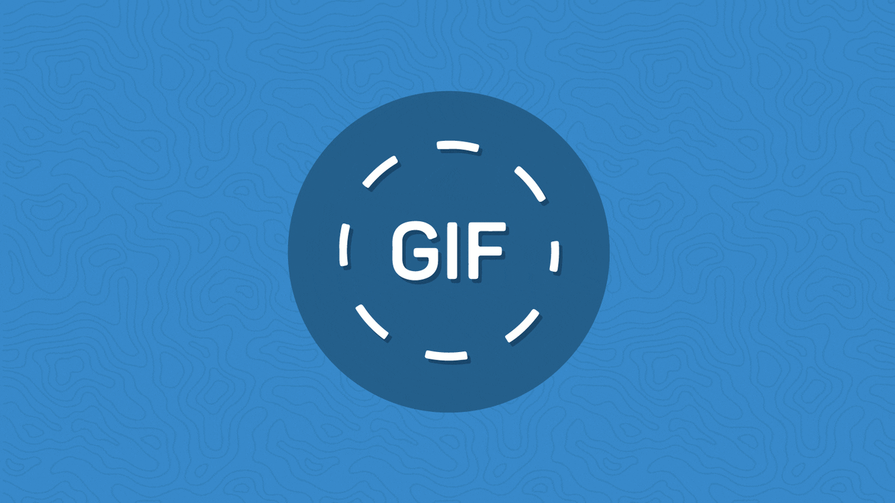

# **Social Distancing Analyzer**

<p align="center">
  
</p>

Welcome to a humble social distancing analyzer, this repo was developed by engineers with love and too much free time, they tried to don't die of boring in the global quarantine due to the COVID-19, thank you china! ... 

Here you have the code and everything that you'll need to perform your own intrinsic and extrinsic calibration, and run an object detection model to track the people in a warped space and analyze how far or close they are to each to other.

**Status**: Archive (code is provided as-is, no updates expected)

<p align="center">

</p>

<sub>#computer-vision #Ai #object-detection #YOLO #covid19 #extrinsic #intrinsic #calibration #social-distancing #OpenCV #tensorflow #cuda #nvidia</sub>

---
### **1. Install Anaconda Environment**

Anaconda is the preferred method of installing SafeDistanceDetector dependencies on Linux Systems. Anaconda is a data science platform for scientific computing and makes managing machine learning libraries significantly easier. Native installation of these libraries is possible, but native un-installation of these libraries can be significantly painful and introduce significantly much more bloat. which is why We DO not will not be supporting that method of installation.

To download the installer, follow this link and download the Anaconda platform for Linux x64. https://www.anaconda.com/distribution/#linux.

After installing the platform, you might need to add conda command into your path for further usage of the platform. You can do this with the following commands.

    export PATH=~/anaconda3/bin:$PATH
    conda init bash
    # Restart your shell
    
---
### **2. Install SafeDistanceDetector Environment**

You will now need to create the SocialDistancingAnalyzer environment with the following libraries. After creating the environment, you can activate it to work within the environment. You will not typically need to activate the environment when using this fork, as the scripts will automatically set it for you. If you want to change the name and other behaviors in the scripts, alter ```env.sh``` found in the configs directory.

After creating and activating the environment, you will need to clone the repo and additionally install more dependencies using the Python command. Make sure your environment is active before doing this, or you will be using your system Python!

    conda create -n social_distancing_analyser -c main python=3.6.8 cudnn=7.6.5 cudatoolkit=10.0.130
    conda activate social_distancing_analyser
    python -m pip install -r ./Safe-Distance-Detector/requirements.txt

---
### **3. Intrinsic Calibration (Optional)**

The process of geometric camera calibration (camera resectioning) is a fundamental step for any machine vision and vision robotics applications. The intrinsic parameters, also known as internal parameters, are the parameters intrinsic to the camera itself, such as the focal length and lens distortion. This distortion should be corrected to operate mathematically easier the image on a warped space or in a affine transformation. Unfortunately, the result of the calibration process can vary a lot depending on various factors.

<p align="center">

</p>

With the script ```calibrate_instirnsic.py``` located in *./calibration* path you can calculate the correct camera matrix and distortion coefficients of your camera using a  [calibration chessboard pattern](https://storage.googleapis.com/vision-198622-kiwibot-packages/documentation_resources/vision/chessboard.pdf) (6x4). The distortion matrix is used to undistort the video, images or the camera streaming for extrinsic calibration and warped space operations.

[Chessboard for Calibration](https://storage.googleapis.com/vision-198622-kiwibot-packages/documentation_resources/vision/chessboard.pdf): The pattern size and quality is of extreme importance. Let’s consider the case of a chessboard pattern. The calibration process requires to detect the inner corner of the chessboard and the assumption of the algorithm is that every chessboard square is a perfect square. Another assumption is, hence, that the pattern is **perfectly planar**. So, DO NOT print the pattern at home. Seriously. Go to a professional print shop and ask them to create the pattern for you. They have the right software to create the chessboard with squares with the real desired square size with an extremely high accuracy. More than everything, they can print the pattern on a white opaque, rigid and planar material. Stress the print shop to print on some extremely rigid opaque white material. You should read [Camera calibration guidelines](https://pgaleone.eu/computer-vision/2018/03/04/camera-calibration-guidelines/).

If you are making your calibration videos, or taking pictures from the camera that you are gonna use. remember move the chessboard across through all the camera view, apply a pitch, roll and yaw angle, and move the pattern in all directions.When you run the script, you'll get a help menu. Use between 15 to 25 pictures of your chess board pattern following the previous instructions and recommendations. 

1 - Move the pattern along the camera view           |  2 - Apply a pitch, roll and yaw angle
:-------------------------:|:-------------------------:
    |  

You can calibrate taking snapshots from your camera, or from pictures or from videos just run:

    python3 calibration/calibrate_intrinsic -i <<your input: video name, imgs path or video device>>

Remember pass `-i` argument as absolute path for videos, if input argument is an image, it should be located in the *./calibration/chess_board*. 

If the calibrations succeed you get a [ **intrinsic.yaml**](https://github.com/JohnBetaCode/Safe-Distance-Detector/blob/develop/configs/intrinsic.yaml) file in the *./configs* folder. This yaml file has the next data:

* **distortion_coefficients**: vector of distortion coefficients 
* **rectification_matrix**: camera distortion matrix
* **camera_matrix**:  3x3 floating-point camera matrix 
* **image_height**: images source height
* **image_width**: images source width

You can use the scripts of the next sections to validate how well your calibration result is. However, if you'll use camera surveillance streamings or security cameras is possible than these already give you an undistorted image, so the intrinsic calibration process is not needed, and you just lost your time reading this section. 

---
### **4. Extrinsic Calibration**

The extrinsic parameters, also known as external parameters or camera pose, are the parameters used to describe the transformation between the camera and its external world. What you are gonna do here is use a dirty trick to transform the 3D image view space in a 2D space.

run from the parent folder the script 'calibrate':

Original image view with surface projection drawn           |  warped space from surface projection (Affine transformation)
:-------------------------:|:-------------------------:
 |  

 Horizontal measure | Vertical measure   
:-------------------------:|:-------------------------:
  |  


---
### **5. Object Detector**

---
### **6. Social Distancing Inspector**

---
### **7. Results**

 Shopping, People, Commerce, Mall, Many, Crowd, Walking Free Stock video footage YouTube  |  Shopping, People, Commerce, Mall, Many, Crowd, Walking Free Stock video footage YouTube
:-------------------------:|:-------------------------:
    |  
https://www.youtube.com/watch?v=WvhYuDvH17I |https://www.youtube.com/watch?v=WvhYuDvH17I

 Shopping, People, Commerce, Mall, Many, Crowd, Walking Free Stock video footage YouTube  |  渋谷 スクランブル交差点 ライブカメラ / Shibuya Scramble Crossing Live Camera
:-------------------------:|:-------------------------:
    |  
https://www.youtube.com/watch?v=mRe-514tGMg |https://www.youtube.com/watch?v=kQFo1bVV81c

<!-- 浅草 雷門 ライブカメラ / Asakusa Kaminarimon Gate Live Camera -->
<!-- Times Square - Midtown Manhattan, New York City - Times Square Live Camera 24.7 | Subscribe now! -->
<!-- EarthCam Live: Times Square in 4K -->

---
### **8. Shortcomings and Improvements**

* Customize, perform or improve object detection model to detect better the people under different scenarios. 
* Object detection pipelines or models could have better performance.
* General gui code optimizations and improvements

---
### **Meme Zone**

Keep save and don't forget ...

Wash your hands |   
:-------------------------:
|  

Use face mask  |  Keep your distance
:-------------------------:|:-------------------------:
 |  

---
### **Other Projects**

[](https://www.youtube.com/watch?v=UIxAvWMknCE)
[](https://www.youtube.com/watch?v=GFoGM6q34pg)
[](https://www.youtube.com/watch?v=muHPgD69cwE)
[](https://www.youtube.com/watch?v=o3hAfaeo0XE)
[](https://www.youtube.com/watch?v=tPihhnXcGKM)
[](https://www.youtube.com/watch?v=4vM0W3lUiuM)
[](https://www.youtube.com/watch?v=r5-JHjTwx8c)
[](https://www.youtube.com/watch?v=TfKW2aXsCQQ)
[](https://www.youtube.com/watch?v=Z4jQc3-psy8)
[](https://www.youtube.com/watch?v=0U3lQ1u-Hd4)
[](https://www.youtube.com/watch?v=VX4ywdUtaI4)
[](https://www.youtube.com/watch?v=0BHpz8lCFfc)

---
<p align="center">
 
</p>

<!-- 
procesamiento de imagenes para analisis de distanciamento social usando sistema embebido
computer vision for social distancing analysis using an embedded AI computing device

areas a tratar o keywords: Ai, computer vision, Object detections 
(TensorRT, YOLO), OpenCV (Intrinsic, Extrinsic), Python, Git, JetsonTx2 
(CUDA, Nvidia), Virtual Enviroment, Social-distancing, COVID-19.

 -->